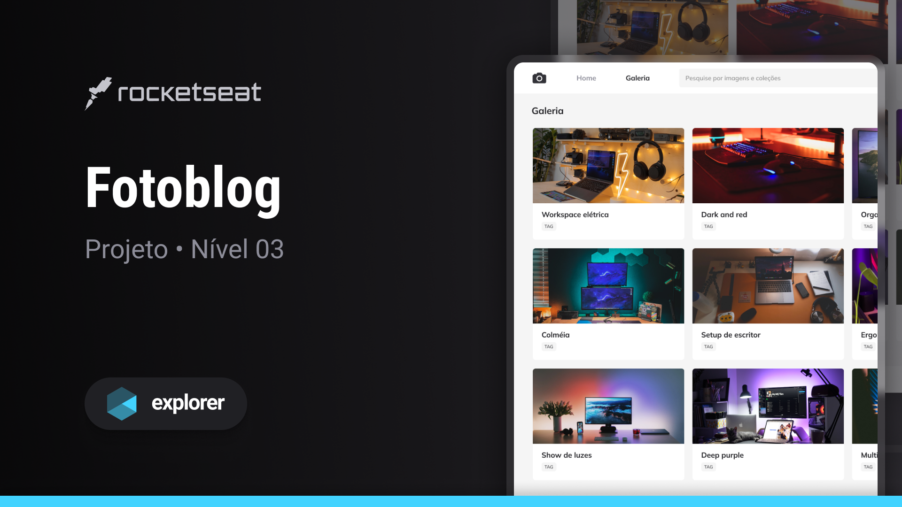

# NOME DO PROJETO | NAME THIS PROJECT | NOMBRE DEL PROYECTO

### Fotoblog

## DESCRIÇÃO | DESCRIPTION | DESCRIPCIÓN

Este é um pequeno exemplo de um blog com fotos usando HTML e CSS realizado na trilha Explorer da Rocketseat.  
This is a short example of blog with photos using HTML and CSS realized on the Rocketseat Explorer trail.  
Este es un pequeño ejemplo de um blog con fotos utilizando HTML y CSS realizado el la trajectoria Explorer en Rocketseat .

:)

